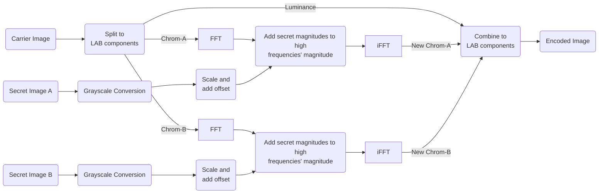

# Rubie's Steganography
[](https://doi.org/10.5281/zenodo.15488035)

This code implements the paper "Digital Image Steganography: An FFT Approach" by Tamer Rabie. It is a way to embedding two images to one carrier image.


#### Encoding Algorithm


### Installation
```bash
~$ pip install rubies
```

### Usage
Within the examples below, you will be completely understand all the functionality of `rubies` package.

#### Encode Two Images into an Image
```python
# Import Rubie's Encoder.
from rubies import Encoder
# Create an encoder instance with carrier image.
encoder = Encoder("carrier_image.png", secret_size=(500, 500))
# Encode the secret images onto carrier. Return value can be also used.
encoded_image = encoder.encode("secret_image_a.png", "secret_image_b.png")
# Save the image.
encoder.save("encoded_image.png")
```

#### Decode an Image with Unknown Secret Size

```python
# Import Rubie's Decoder.
from rubies import AutoDecoder
# Create a decoder instance with encoded image and carrier image.
decoder = AutoDecoder("encoded_image.png")
# Decode the secret images from the encoded image. Return values can be also used.
secret_image_a, secret_image_b = decoder.decode()
# Save the secret images.
decoder.save("secret_image_a.png", "secret_image_b.png")
```

#### Decode an Image with Known Secret Size

```python
# Import Rubie's Decoder.
from rubies import SimpleDecoder
# Create a decoder instance with encoded image and carrier image.
decoder = SimpleDecoder("encoded_image.png")
# Decode the secret images from the encoded image. Return values can be also used.
secret_image_a, secret_image_b = decoder.decode(secret_image_sizes=(500, 500))
# Save the secret images.
decoder.save("secret_image_a.png", "secret_image_b.png")
```
